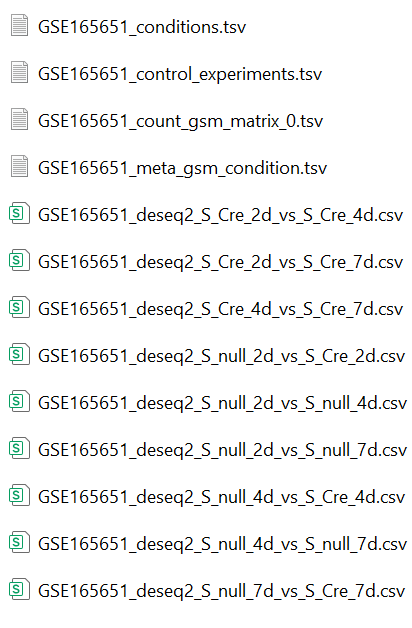

# Data Analysis Pipeline for GEO Accession Data 

## Overview
This project provides an end-to-end data analysis pipeline for GEO (Gene Expression Omnibus) accession datasets.

GEO data are often heterogeneous, inconsistently annotated, and frequently unsuitable for standard analysis workflows without extensive manual cleaning. 
This pipeline is designed to handle such real-world conditions and to analyze any GEO dataset that can be reasonably interpreted.

This pipeline automatically cleans and aligns sample metadata, preprocesses count matrices, constructs appropriate experimental designs, and selects the correct statistical method based on data type and replicate availability. 
Depending on the input, the pipeline generates either full DESeq2 differential expression results or log2 fold-change summaries using limma-based methods.

## Methodology & Design
This pipeline follows a stages, decision-driven architecture designed to robusely process heterogenuous GEO datasets and produce interpretable differential expression results. 
### Stage 1: Metadata -> Experimental Design
`Cleantitle_v3.py` reads in series matrix files downloaded by `save_gse_meta.R` and conducts systematic cleaning of the 'title' column of the series matrix to identify the unique experimental conditions and the repetitions. This step is essential to DESeq2/limma+voom workflow, because repetitions are needed for p-val calculation. 

The main challenge arises from the highly heterogeneous and unconstrained naming conventions used in sample titles. In this pipeline, we adopt a separator-based parsing strategy, assisted by a lightweight keyword dictionary, to identify and isolate numeric tokens corresponding to replicate indices, animal identifiers, or sequencing runs.

From the cleaned metadata, an separatorand-counter based algorithm is devised to construct case-control comparisons that define the downstream statistical tests. 
### Stage 2: Raw files -> Count Matrix
`DownloadCounts_v2.py` searches the GEO accession files on the website and requests downloads of count data candidatates using keyword-based detection/filtering. Candidate files are decompressed if necessary, and insepcted for single or multiple count-matrix entries. 

Count matrices are ingested using the pandas Python engine. Field separators are automatically inferred, after which a column-count–based heuristic is applied to distinguish the numeric matrix from comment or annotation rows. Column headers are then detected and validated against the metadata TSV by attempting numeric coercion, allowing reliable identification of sample columns.

If aggregation is needed, count data are aggregated at the GSM level. The combined count matrix has:
- rows -> Gene Ids
- columns -> GSM sample IDs.
Column ordering is explicitly aligned with the cleaned metadata tsv to ensure consistency in the DESeq2/limma workflow.

The current keywords dictionary:
 - good_keywords_set = `{'raw','count','matrix','.mtx','rpkm','fpkm','tpm','cpm'}`
 - bad_keywords_set = `{'ercc', 'spike', 'phix', 'rrna', 'gfp', 'rfp', 'mcherry', 'mt-', 'summary',
                        'report', 'statistics', 'sample_sheet', 'bed', 'bedgraph','peak','hepa', 'cluster'}`
 - comment_header_set = {'!','#','notes','summary','%','^'}
 - bad_extension_set = `{'.bed','.bedgraph','.wig','bigwig','.bam','.sam','.gtf','.vcf','.soft','.gff','.peak','.narrowpeak','.bw','.fastq','.fq','.family','.idat','.sra',
                            '.ann','.rds','.rdata','.rda','.h5','.h5ad','.loom','.cel','.doc','.docx'}`
   
Supported file types:
 - Archives: `.tar, .zip,.7z,.gz,.rar`
 - Data: `.xlsx, .xls, .csv, .tsv, .txt, .mtx`
 - Special: no extension, user-customized type

### Stage 3: Statistical Engine (R) -> Final Results
Cleaned metadata and aggregated count matrices are passed to an R-based analysis core.

Based on the data characteristics detected at runtime—specifically whether the values are integer or continuous, and whether biological replicates are present—the pipeline automatically selects an appropriate statistical framework:
- **DESeq2** for integer counts with replicates  
- **limma-voom** for integer counts without replicates  
- **limma** for continuous expression values  

Case–control comparisons derived from metadata are applied to generate final differential expression statistics, including log fold changes and significance metrics where applicable.
## Requirements
### R Environment
- R (>=4.2)
- RStudio 
Required R packages:
- DESeq2
- limma
- edgeR
- GEOquery
Install R dependencies via Bioconductor:
```r
install.packages("BiocManager")
BiocManager::install(c(
      "DESeq2",
      "limma",
      "edgeR",
      "GEOquery"))
```
### Python Environment
- python(>=3.9)
  - **Add python executable to system path**
```
python -m pip install -r requirements.txt
```
## Usage
### Working Directory Assumption
This pipeline assumes the existence of an `/R space/` directory (see in `.R` scripts), where all the source codes need to be placed into. 
This working diretory is expected to be manually created by the user, under the path: `C:/Users/{username}/Documents`, which is the default home directory set by RStudio. 

### Running the Pipeline
The pipeline is executed by the python file `main_v2.py`. Run the pipeline by providing a GEO accession ID:
```bash
python main_v2.py GSE269485
```
Alternatively, if no GSE accession ID is provided, the pipeline will prompt for user input. The input can be pure numbers or numbers mixed with characters.

### Interactive Prompts
While the pipeline is designed for full automation, there are certain (rare) cases where assumptions cannot be made safely and user interaction might be required. 
1. **Metadata cleaning**
   - If more than 20 unique experimental conditions are detected after all the cleaning procedures, the pipeline will prompt user to either:
     - continue the analysis, or
     - stop and inspect sample titles for potential un-cleanable complications
2. **Multiple series matrix files**
   - If more than one series matrix file is detected for a GEO accession, it is because the samples are interpreted by different GPLs (GEO Platform), and they cannot be compared or combined in the analysis. Therefore, the pipeline will prompt the user to select one matrix at a time (0-indexed).
3. **Count matrix column selection in single GSM files**
   - When aggregating GSM-level count matrices, we expect two columns, 1st column being Genes and 2nd column being counts. If there are more columns, the pipeline will prompt the user to check and specify which column represents the column data.

## Outputs
The pipeline generates a set of intermediate and final result files under the working directory for each GEO accession. 
### Intermediate files
- `{GSE_ID}_meta_gsm_condition.tsv` Metadata matrix with GSM IDs, pre-cleaned titles, descriptions if applicable, pose-cleaned conditions. Note, only the GSMs detected in the count matrix files are kept.
- `{GSE_ID}_conditions.tsv` Unique conditions from post-cleaned titles.
- `{GSE_ID}_control_experiments.tsv` Autoamtically inferred case-control pairs from unique conditions. This file is used in pipeline case-control design for statistical analysis.
- `{GSE_ID}_(count|var)_gsm_matrix_{i}.tsv` Preprocessed aggregated count matrix (i-th downloaded file) with Gene IDs as the first column and Sample IDs (GSM) as the first row. Note, the GSMs follow the same order as in the 'geo_accession' column in the metadata tsv.
  - 'count' stands for integer count data and 'val' stands for normalized count data.

### Final analysis results
Depending on the data type and replicate availability, the pipeline generates two or more statistical result tables:
- DESeq2 results:
  - Generated for integer count data with biological replicated experiments.
  - p-values
  - p-adj
  - baseMean
  - logFC
  - lfcSE
- limma/ limma-voom results:
  - Generated when replicates are unavailable. limma-voom is used for integer count data, and limma is used for normalized count data.
  - logFC
  - logMean (AMean)
### Example output directory

## Directory 
```
├── src/
|   ├── main_v2.py
│   ├── save_gse_meta.py
│   ├── Cleantitle_v3.py
│   ├── DownloadCounts_v2.py
│   ├── run_deseq2_v2.py
│   ├── run_limmaVoom_v2.py
│   ├── run_limma_v2.py                             
│
├── scripts/
│   ├── Downloadcount_v2_script.py                   
│
├── docs/
|   ├── Screenshot_outputs_directory.png
|
├── LICENSE
├── README.md                     
└── requirements.txt
```
## Notes
- This pipeline operation relies on count matrices of Gene IDs. It does not handle FASTQ files, read alignment, or quantification from raw sequencing data.
- As long as a GEO dataset provides Gene-level count data that can be parsed and aggregated at the GSM level, the pipeline is expected to work.
- Due to the heterogeneous and often noisy nature of public GEO data, users are encouraged to inspect intermediate results and pay attention to the console outputs for warning or error messages. 
